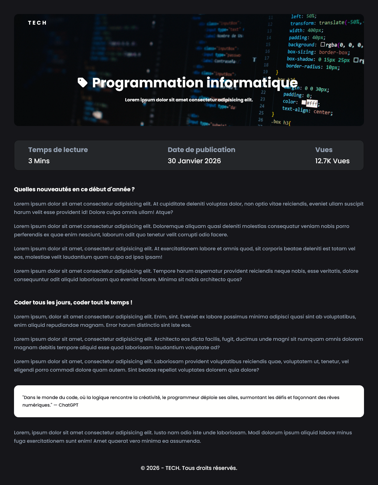

## SIMPLE PAGE BLOG

## Le challenge

Création d'une page de blog simple et entièrement responsive. Pour se faire, j'ai utilisé la propriété css flexbox et les medias queries pour rendre le projet responsive, ainsi que la propriété background pour l'arrière-plan.

## Démonstration

Lien vers le projet :

## Projet développé avec

- Utilisation des balises sémantiques HTML5
- CSS3
- Flexbox
- Importation de la police "Poppins"
- Utilisation d'un normaliseur : le fichier normalize.css
- Importation de font-awesome
- Commentaires HTML
- Commentaires CSS
- Desktop first
- Responsive design
- JavaScript
- Code JavaScript commenté
